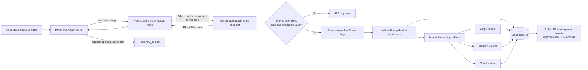

# ADR 0001: Inline image attachments with Active Storage and Cloudflare R2

- Status: Accepted
- Date: 2026-07-23

## Context

Memoly notes use Markdown and need a GitHub-style drag-and-drop image experience. Images also need to be attachable to collections. The application must reject unsupported or oversized files, produce responsive derivatives, and avoid predictable object paths.

## Decision

Use Rails Active Storage with a custom Cloudflare R2 service adapter. `Note` and `Collection` both include the same `ImageAttachable` concern and expose authenticated nested image endpoints.

The UI posts multipart data to a same-origin Next.js route. That route forwards the authenticated request to Rails without exposing the OAuth cookie or R2 credentials to browser code. Rails detects the file type from its bytes with Marcel, checks both MIME type and filename extension, uploads the original under a random key, creates all variants, and returns ready-to-use Markdown.

Every original key has three independently random path components:

`<128 random bits>/<128 random bits>/<192 random bits>`

Tracked Active Storage variants are stored as derivative blobs and use the same random three-level key generator. No user ID, record ID, collection slug, original filename, predictable variant folder, or sequential identifier appears in an object path.

The named variants preserve aspect ratio and never upscale beyond:

- Large: 1600 × 1600
- Medium: 960 × 960
- Small: 480 × 480

Variant generation is completed synchronously before the upload response is returned. The named variants are not also marked `preprocessed`, because that would enqueue duplicate transform jobs racing the request-time processing.

## Architecture

## API shape

- `POST /users/:user_id/notes/:note_id/images`
- `DELETE /users/:user_id/notes/:note_id/images/:id`
- `POST /users/:user_id/collections/:collection_id/images`
- `DELETE /users/:user_id/collections/:collection_id/images/:id`

Uploads use the multipart field `image`. The response contains the original URL, all three variant URLs, and a Markdown image tag pointing at the medium variant.

## R2 endpoint calibration

The supplied S3 API URL includes a bucket path for human reference:

`https://b117eaf8a60a15250e60a40a29e4a92b.r2.cloudflarestorage.com/memoly-bucket-prod`

The AWS SDK must instead receive the account endpoint without the bucket suffix because `bucket: memoly-bucket-prod` is configured separately:

`https://b117eaf8a60a15250e60a40a29e4a92b.r2.cloudflarestorage.com`

R2 does not implement S3 object ACLs. The custom service therefore generates public-domain URLs without sending `public-read` ACLs during upload.

## Consequences

- Application servers handle upload bytes and image processing, which keeps credentials and validation centralized but consumes request CPU and memory.
- Upload completion waits for three variants, making returned URLs immediately usable.
- Four objects are stored per uploaded image: original, large, medium, and small.
- Public-domain URLs behave as unguessable capability URLs. They are difficult to enumerate but are not access control once shared.
- Deleting a note, collection, or individual attachment purges its original and derived objects through Active Storage lifecycle hooks.

## Alternatives considered

- Direct browser-to-R2 uploads reduce application bandwidth but require a multi-step presign, validation, attach, and cleanup protocol.
- Predictable record-based folders simplify manual browsing but leak hierarchy and permit enumeration.
- On-demand variants shorten upload time but can return URLs before derivatives exist and create latency on first view.
